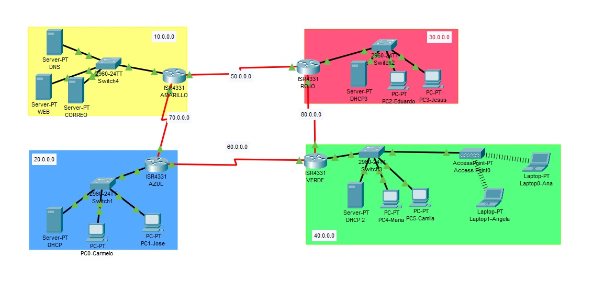

# 1. Proyecto: Diagnóstico e Interconexión de Red Multisegmento WAN
## Ingeniero/a: Carmelo-D

---

## 🚀 Resumen del Proyecto
Este proyecto simula la **implementación, configuración y, crucialmente, la resolución de fallas (Troubleshooting)** de una red que interconecta cuatro segmentos LAN principales (10.0.0.0, 20.0.0.0, 30.0.0.0, 40.0.0.0) a través de una infraestructura de Área Amplia (WAN) utilizando routers Cisco ISR 4331.

**Objetivo Principal:** Asegurar la conectividad completa entre todos los segmentos, configurar servicios de red esenciales (DHCP y DNS), e implementar un enrutamiento estático robusto, **corrigiendo las configuraciones defectuosas de origen**.

---

## 🌐 Topología y Requisitos

### Diagrama de Red


### Segmentos de Red Principales
| Segmento (Color) | Red Principal | Tipo de Servicios |
| :--- | :--- | :--- |
| **Amarillo** | 10.0.0.0/24 | Servidores Centrales (DNS, Web, Correo) |
| **Azul** | 20.0.0.0/24 | Servidor DHCP Centralizado, Clientes |
| **Rojo** | 30.0.0.0/24 | Clientes y Servidores Locales |
| **Verde** | 40.0.0.0/24 | Clientes Inalámbricos y Servidores Locales |

### Requisitos Clave
1. Configuraciones IP de acuerdo a cada segmento (incluyendo subredes WAN).
2. Configuración de **DHCP** para PCs y *servers* (excluyendo IPs estáticas).
3. **Enrutamiento Estático** completo entre todas las redes.
4. Configuración de seguridad básica (Contraseñas y MOTD).

---

## 🔍 Proceso de Diagnóstico y Solución (Troubleshooting)

Se utilizó un enfoque estructurado (Modelo OSI) para aislar y corregir las fallas heredadas de la configuración inicial.

### Falla Crítica 1: Ausencia de Rutas Estáticas (Capa 3 - Red)
**Diagnóstico:** Inicialmente, los routers solo conocían sus redes conectadas directamente. El **Router ROJO**, por ejemplo, no tenía rutas definidas para alcanzar las redes 10.0.0.0 (Amarilla) y 20.0.0.0 (Azul), lo que generaba fallas de ping entre sucursales.

**Comando de Diagnóstico:**
```bash
ISR-ROJO# show ip route
# (Se verificó la ausencia de rutas estáticas o dinámicas hacia redes remotas, resultando en 'Destination Host Unreachable' en los pings de origen).
